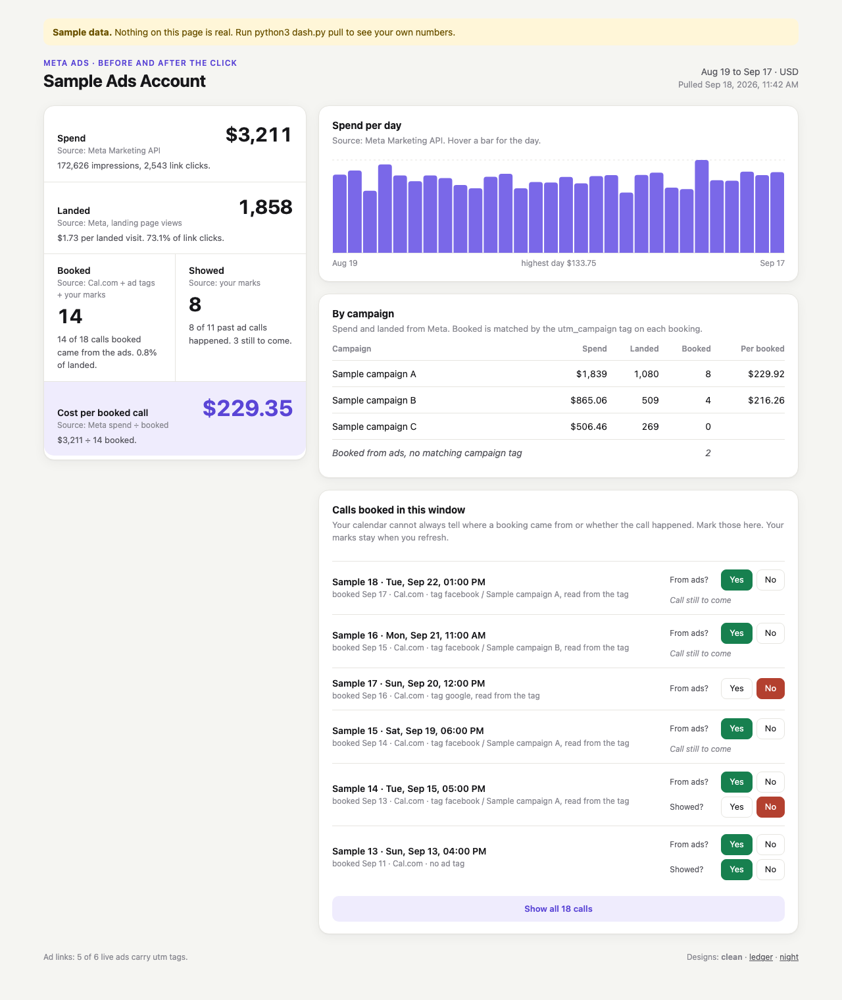
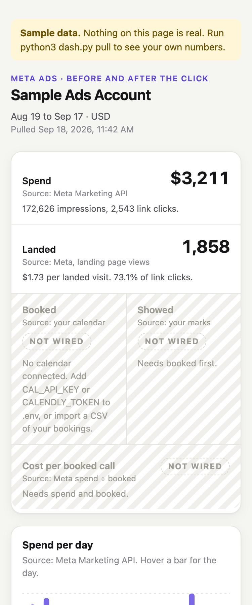
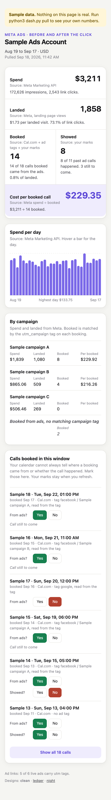
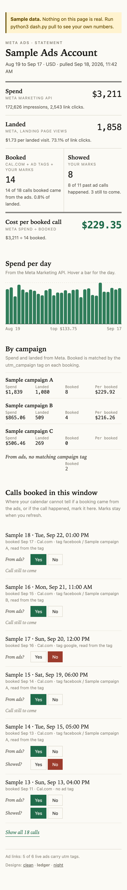
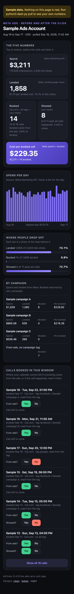

# Meta Ads Dashboard. Track your Meta ads on one page, built with Claude

One script pulls your numbers. One page shows them. Spend, landed, booked, showed and cost per booked call, top to bottom, for the last 30 days. It runs on your own computer, and every number on it says where it came from.

From this video: [How to Track Your Meta Ads in One Dashboard, Built With Claude](https://www.youtube.com/@Hamzaouladd)



*Sample data. Every number above is fake.*

## What you get

- `PROMPT.md` is the build prompt from the video. Paste it into Claude Code in an empty folder and Claude builds the whole thing with you from zero.
- `CLAUDE.md` tells Claude Code what to do inside this repo. Open Claude Code here and it walks you through the six steps below, one at a time.
- `dash.py` is the finished script. It pulls Meta and your calendar into one table, serves the page, and checks one day against Ads Manager. Python 3 only. Nothing to install.
- `designs/` holds three page designs: `clean`, `ledger` and `night`. Pick the one you like.
- `prompts/` holds short follow up prompts: connect your funnel, add showed, make it look better, run it every hour.
- `test_dash.py` checks the maths. Run it after any change.

## See it before you connect anything

```bash
python3 dash.py --sample
```

Your browser opens the page with fake numbers. Nothing is connected and nothing leaves your computer. Try the other designs at `http://localhost:8787/d/ledger` and `http://localhost:8787/d/night`.

To see what an unconnected calendar looks like:

```bash
python3 dash.py --sample meta-only
```



| clean | ledger | night |
|---|---|---|
|  |  |  |

## Two ways to build it

**The way from the video.** Open Claude Code in an empty folder. Paste `PROMPT.md`. Claude asks for what it needs, one thing at a time, then builds it.

**The fast way.** Clone this repo and open Claude Code inside it. Say *set this up for me*. Claude reads `CLAUDE.md` and takes you through the same steps with the script that is already written.

**By hand.** Follow the six steps below.

```bash
git clone https://github.com/qemoza/meta-ads-dashboard.git
cd meta-ads-dashboard
cp .env.example .env      # then fill it in
python3 dash.py           # pulls the numbers and opens the page
```

## The six steps

### 1. Your Meta key

You need two things: a token that can read your ads, and your ad account number.

1. Open [Meta Business settings](https://business.facebook.com/settings).
2. Go to **Users**, then **System users**. Press **Add**. Call it `dashboard`. The Employee role is enough.
3. Press **Assign assets**. Pick **Ad accounts**, pick your ad account, and turn on view performance. Save.
4. The token needs an app. If you have none, go to [Meta for Developers](https://developers.facebook.com/apps), press **Create app**, and connect it to your business portfolio.
5. Back on your system user, press **Generate token**. Pick the app. Pick the `ads_read` permission. Set it to never expire if Meta offers that. Copy the token. If your app is missing from the list, assign the app to the system user the same way you assigned the ad account.
6. Open Ads Manager. Your ad account number is in the account menu at the top left, and in the address bar after `act=`. Copy the digits.

Put both in `.env`:

```
META_ACCESS_TOKEN=paste the token here
META_AD_ACCOUNT_ID=paste the number here
```

Meta moves these buttons around. If a name on your screen is different, open Claude Code, take a screenshot, and ask Claude where to click.

### 2. Pull the numbers into one table

```bash
python3 dash.py pull
```

This pulls the last 30 days from the Meta Marketing API. One row per day per ad set: spend, impressions, link clicks and landing page views. It all goes into `data.db`, a single file next to the script. It prints the first rows so you can see it worked.

Run it every hour to keep the page fresh. See [Keep it running](#keep-it-running).

### 3. Tag your ad links

This is how a booking gets tied back to the ad that brought it.

1. In Ads Manager, open an ad and scroll down to **Tracking**.
2. Find the **URL parameters** box and paste this:

```
utm_source=facebook&utm_medium=paid&utm_campaign={{campaign.name}}&utm_content={{ad.name}}
```

3. Do it for every live ad. Meta fills in the campaign name and the ad name on each click.

`python3 dash.py pull` tells you how many live ads carry the tags. The page footer shows it too.

### 4. Send your bookings in

Put the key for your calendar in `.env`:

- **Cal.com.** Settings, Developer, API keys. Make a key and paste it as `CAL_API_KEY`.
- **Calendly.** Integrations and apps, API and webhooks, Personal access tokens. Make one and paste it as `CALENDLY_TOKEN`.
- **Anything else** (GoHighLevel, a form on your own site, a booking tool with no key). Export your bookings as a CSV and run `python3 dash.py import bookings.csv`. Or open `prompts/connect-your-funnel.md` and let Claude connect it for you.

If you only want sales calls, list their event types in `SALES_EVENTS`.

Now test it once. Open your own landing page with the tags on the end of the address, book a call, and run `python3 dash.py pull`. The booking should show the tag. If it says no ad tag, your calendar is not getting the tags from the page. `prompts/connect-your-funnel.md` has the fix.

Bookings with no tag are not guessed. They wait on the page with a *to mark* badge, and you mark them from the ads or not.

### 5. One page

```bash
python3 dash.py
```

This pulls, then opens `http://localhost:8787`. Top to bottom:

| Number | What it is | Where it comes from |
|---|---|---|
| Spend | What Meta charged you | Meta Marketing API |
| Landed | People who reached your page | Meta, landing page views |
| Booked | Calls booked from the ads | Your calendar, the ad tags and your marks |
| Showed | Ad calls that actually happened | Your marks, or your calendar's no show flag |
| Cost per booked call | Spend divided by booked | Worked out on the page |

Booked and showed sit side by side. A bot can book a call. Only a call that happened is worth paying for.

Pick a design with `python3 dash.py --design ledger`, or set `DESIGN=night` in `.env`.

### 6. Check one day against Ads Manager

```bash
python3 dash.py check              # yesterday
python3 dash.py check 2026-09-15   # any day
```

It prints that day's spend straight from the Meta API next to what the table holds. Now open Ads Manager, set the date range to that one day, and read **Amount spent**. All three should match to the cent. If they do not, the script says so. Look before you trust the page.

## Before the click and after the click

There are two kinds of numbers here.

**Before the click** is spend, impressions, clicks and landed. These come from the Meta API and work the same for everyone.

**After the click** is booked and showed. These depend on your funnel. A custom site, GoHighLevel, Calendly and Cal.com all hand over bookings differently. Cal.com and Calendly are built in. For anything else, open Claude Code here and paste `prompts/connect-your-funnel.md`. Claude asks what you use and wires it in.

## Keep it running

**On your laptop.** The page only runs while your laptop is open. To refresh the numbers every hour, run `crontab -e` and add this line (change the folder to yours):

```
0 * * * * cd /Users/you/meta-ads-dashboard && /usr/bin/python3 dash.py pull >> pull.log 2>&1
```

On a Mac, keep the folder outside Desktop, Documents and Downloads, or macOS stops cron from reading it. The open page picks up new numbers by itself every five minutes.

**On a server.** To keep it running all day, put it on a small server, for example a Hostinger VPS. Copy the folder up, make the `.env` there, add the same cron line, and keep `python3 dash.py serve --no-open` running. Then open it from your laptop through an SSH tunnel:

```bash
ssh -L 8787:localhost:8787 you@your-server
```

Now `http://localhost:8787` on your laptop shows the page from the server. It stays off the open internet. If you want it on a public address, set `DASH_PASSWORD` and `HOST=0.0.0.0` in `.env` and put HTTPS in front of it. The script refuses a public address without a password. `prompts/run-it-every-hour.md` walks Claude through all of this.

## Troubleshooting

- **Meta error #200, or a message about ads_read.** The token cannot read this ad account. Assign the ad account to the system user (step 1, point 3) and make a new token with `ads_read`.
- **Meta error #190.** The token expired or was pasted wrong. Make a new one.
- **HTTP 403 from Cal.com or another API.** Some APIs block the default user agent that Python sends. `dash.py` already sends a browser user agent. If you write your own script, do the same, or you get a 403 even with a good key.
- **Landed says not wired.** Meta sent no landing page views. Check the Meta pixel is on your landing page.
- **Booked says not wired.** Some bookings carry no ad tag. Mark them on the page, or fix the tags (step 3 and step 4).
- **Spend does not match Ads Manager.** Check you picked the same single day. The table only goes up to yesterday, and it uses your ad account's time zone. Run `python3 dash.py pull` again, then `python3 dash.py check` for that day.
- **Meta says the API version is too old.** Set `META_API_VERSION` in `.env` to the newest version in the Meta changelog.
- **Port 8787 is busy.** Run it with `--port 8788`.

## The rules the page keeps

- Every number says where it came from.
- A number that is not connected shows grey and says **not wired**. It is never estimated.
- If there is nothing to divide by, the box stays blank. Never 0, never NaN.
- Booked sits next to showed.
- Your keys stay in `.env`. The script never prints one and never sends one to the page.

## Files

| File | What it does |
|---|---|
| `dash.py` | Pulls, stores, serves and checks. Run `python3 dash.py --help` |
| `designs/clean.html` | Light cards, one accent colour, dark mode follows your system |
| `designs/ledger.html` | Reads like a one page statement |
| `designs/night.html` | Dark, big figures, a drop off panel |
| `designs/dash.js` | Shared by every design. Loads the numbers and saves your marks |
| `PROMPT.md` | The build prompt from the video |
| `CLAUDE.md` | What Claude Code reads first in this repo |
| `prompts/` | Follow up prompts |
| `.env.example` | Every setting, with no values. Copy it to `.env` |
| `test_dash.py` | Run `python3 -m unittest -v` |

MIT license. Use it, change it, sell with it.
